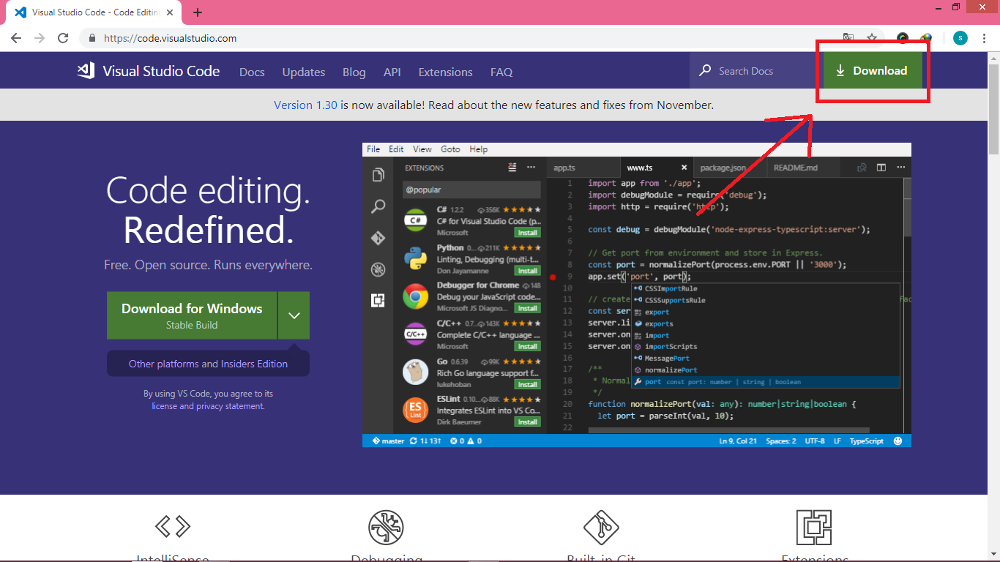
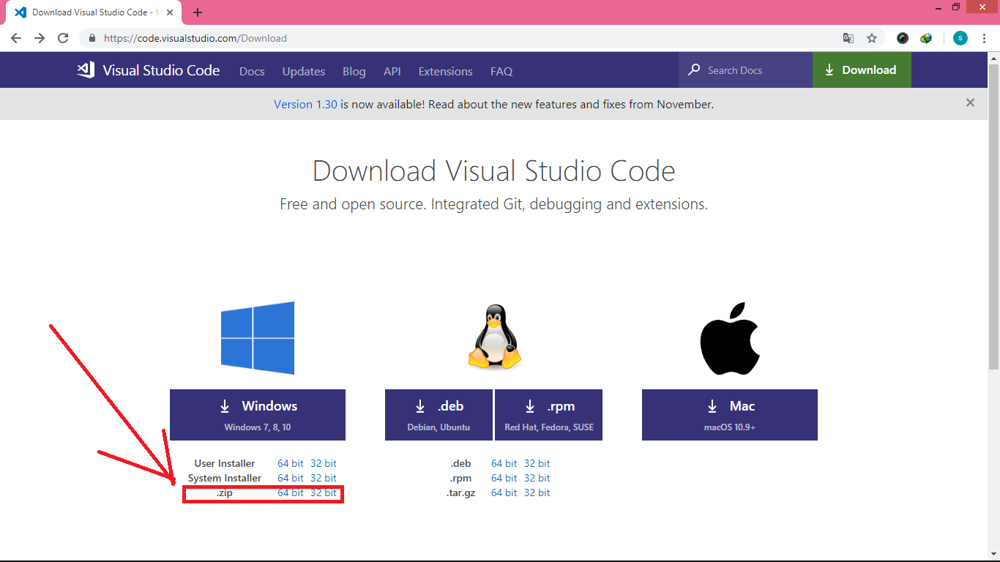
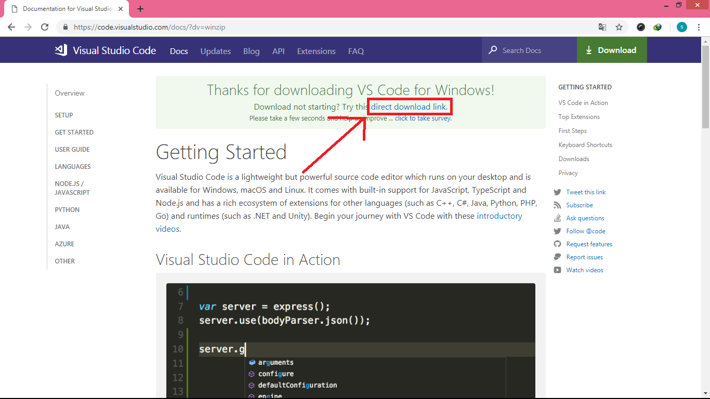
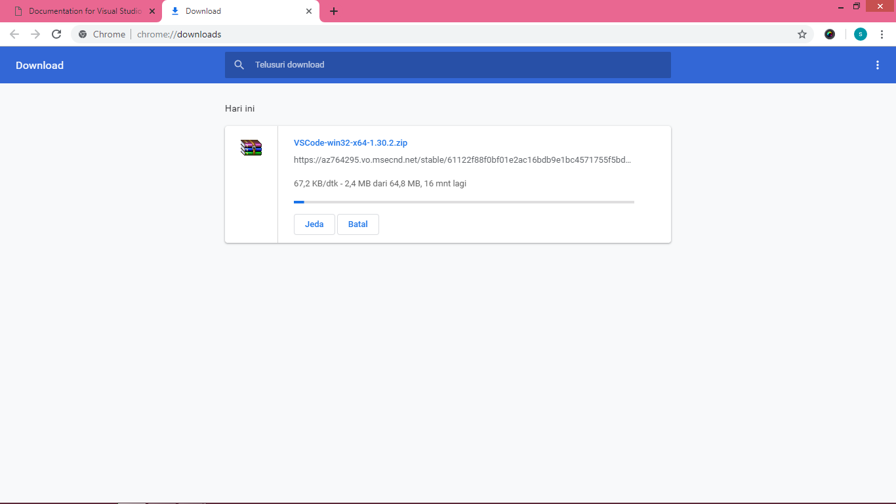
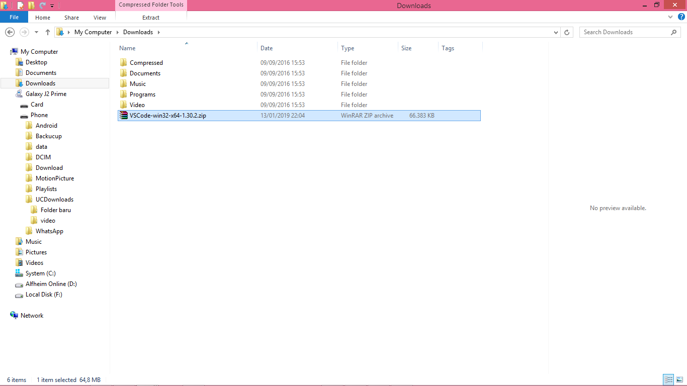
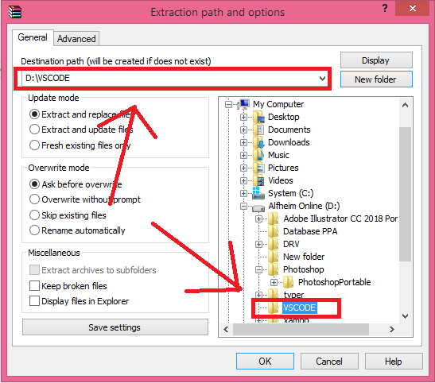
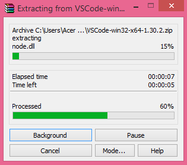
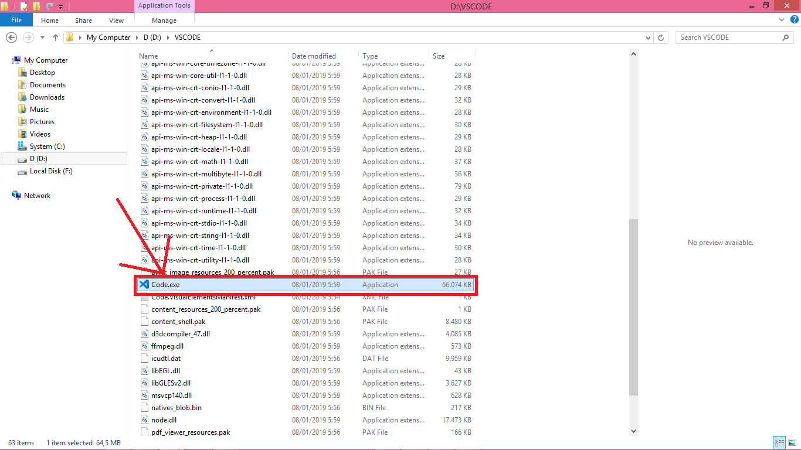
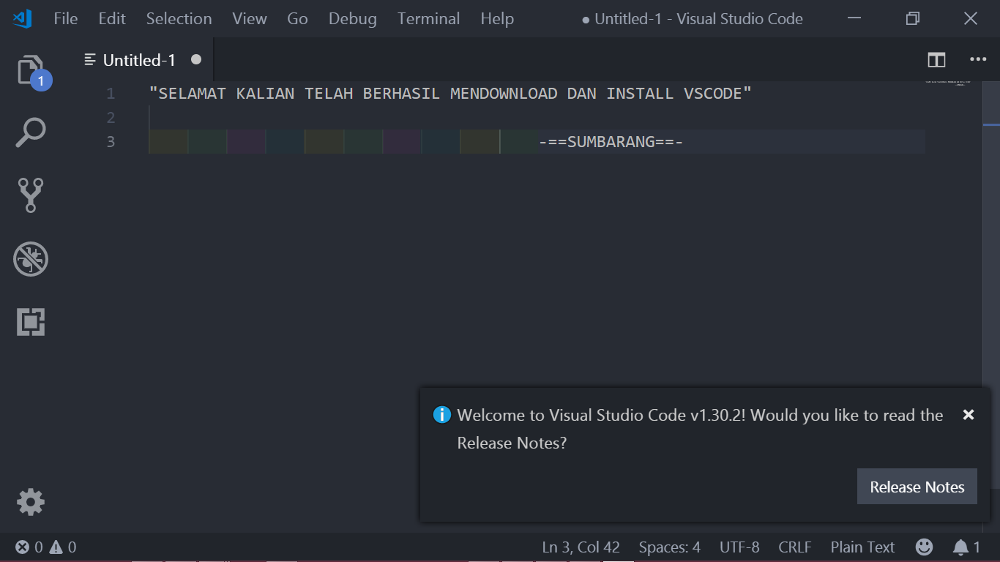

# cara instal visual studio code

1. Buka browser kalian dan ketikkan VSCODE di search engine atau kalian bisa lansung ketikkan alamat code.visualstudio.com

2. Setelahnya kalian akan sampai pada halaman utama website VSCODE. Dari sini lansung saja klik button DOWNLOAD-nya

3. Pilih sesuai sistem operasi kalian namun untuk tutorial kali ini saya akan memilih sesuai dengan laptop saya yaitu windows 64 bit.  saya memilih yang "ZIP"

4. Klik Tulisan "direct download link" jika proses download belum mulai secara otomatis dan tunggu sampai proses downloadnya selesai

5. Sekarang buka dimana kalian menyimpan file VSCODE yang sudah terdownload tadi. klik ekstrak file ZIP-nya

6. Pilih direktori hasil ekstraknya.  Kalian simpan di "local disk C" tapi khusus di tutorial kali ini saya menyimpannya  di "D".

7. Tunggu hingga proses ektraknya selesai

8. Setelai selesai cari di dalam folder hasil ekstraknya sebuah file bernama "Code.exe".  Lalu klik kiri 2x.

9. SELAMAT KALIAN SUDAH BERHASIL MENDOWNLOAD DAN INSTALL VSCODE :)

